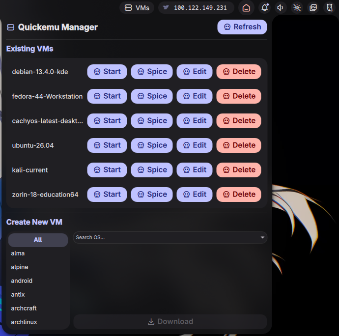

# Quickemu Noctalia Plugin

A native [Noctalia](https://github.com/noctalia-dev/noctalia) shell plugin to seamlessly manage and create [Quickemu](https://github.com/quickemu-project/quickemu) virtual machines directly from your desktop bar.

 *(Add a screenshot if you like!)*

## Features

- **Dynamic VM Management**: Start, edit, and delete virtual machines with ease.
- **Beautiful Catppuccin UI**: Integrates perfectly with modern Wayland desktop aesthetics.
- **Instant OS Downloads**: Built-in support for downloading over 700+ operating systems via `quickget`, complete with real-time progress bars.
- **Background Execution**: Downloads and operations continue safely in the background even if you close the widget panel.

## Prerequisites

Ensure you have the following installed and available in your `$PATH`:
- `quickemu`
- `quickget`
- `xdg-utils` (for opening config files)

## Installation

You can install this plugin manually by cloning this repository directly into your Noctalia plugins folder:

```bash
mkdir -p ~/.config/noctalia/plugins
git clone https://github.com/GughNess/quickemu-noctalia-plugin.git ~/.config/noctalia/plugins/quickemu
```

Once cloned:
1. Reload or restart Noctalia (`killall noctalia; noctalia &` or log out and back in).
2. Open your Noctalia settings menu.
3. Enable the `quickemu` plugin and add it to your desired bar section.

## Configuration

By default, the plugin looks for your Virtual Machines in `~/quickemu/`. If you store them elsewhere, you can change this in your `manifest.json` or through the Noctalia plugin settings UI:

```json
  "metadata": {
    "defaultSettings": {
      "vmDirectory": "/path/to/your/custom/directory/"
    }
  }
```

## License
MIT
